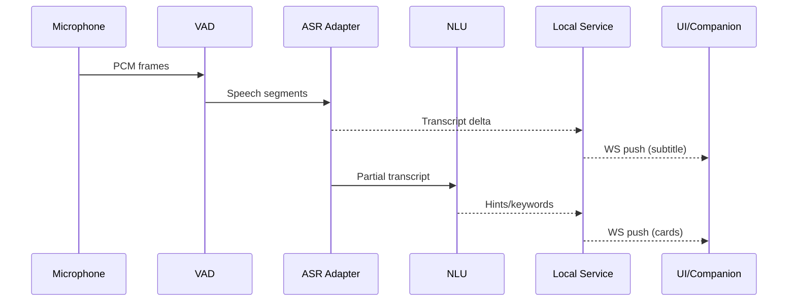

Refer to the root ARCHITECTURE.md for the latest version.

# 架构文档（MVP → 可扩展）

> 版本：v0.1 | 最后更新：2025-09-02 | 适用平台：Windows / macOS / Linux（桌面），Android / iOS（移动伴侣）

## 1. 目标与范围

- 目标
  - 实时麦克风字幕、翻译、会议纪要（桌面与移动）。
  - 局域网伴侣屏：第二设备通过 Web 控制触发桌面截屏，获取 OCR + AI 建议。
  - 合规与隐私优先：显式授权、显著指示、用户主动触发、最小数据外发。
- 非目标
  - 不做系统级注入/Hook/驱动绕过。
  - iOS 不做通话/系统音频捕获。
- 可借鉴形态
  - 第二设备伴侣/遥控截屏交互与产品教育方式（参考：[Offerin AI](https://www.offerin.cn/)）。

## 2. 平台与技术栈

- 桌面端（Windows/macOS/Linux）
  - 外壳：Tauri（前端：React / Vue / Svelte 任一）。
  - 核心：Rust（音频/截屏/本地服务/加密/管线）。
- 移动端（Android/iOS）
  - 外壳：Flutter（伴侣屏 + 控制面板）。
- 云端（可选增强）
  - 模型代理/计费/同步：Rust/Go + Postgres。
  - 对象存储（可选）。
  - 向量检索：本地优先（Tantivy/SQLite FTS），云再议。

## 3. 关键能力与平台差异

- 音频采集（仅麦克风）
  - Windows: WASAPI（通过 `cpal`）。
  - macOS: AVAudioEngine/AudioUnit（TCC 麦克风权限）。
  - Linux: PulseAudio/PipeWire。
  - Android/iOS: 系统麦克风（不采通话/系统输出）。
- 屏幕截取（桌面按需触发）
  - Windows: Windows.Graphics.Capture API（Win10+）。
  - macOS: ScreenCaptureKit/CGDisplayStream（需“屏幕录制”权限）。
  - Linux: X11/Wayland（体验差异较大，MVP 不承诺一致）。
- 远控与伴侣屏
  - 本地 Web 服务（Rust axum）+ WebSocket/SSE。
  - mDNS/二维码配对 + 短期 Token + 自签 TLS（`rustls`）。

## 4. 总体架构（逻辑视图）

```mermaid
graph TD
  subgraph Desktop App (Tauri)
    UI[UI (React/Vue)]
    IPC[Tauri IPC]
  end

  subgraph Rust Core
    ACAP[Audio Capture + VAD]
    ASR[ASR Adapter (Local/Cloud)]
    TRANS[Translate/Summarize/NLU]
    SCAP[Screen Capture]
    OCR[OCR Pipeline]
    SVC[Local Web Service (axum)]
    AUTH[Pairing & Auth (TLS, Token)]
    DB[(SQLite/SQLCipher)]
    CFG[Settings/Policy]
  end

  subgraph Mobile App (Flutter)
    MUI[Companion UI]
  end

  subgraph Cloud (Optional)
    LLM[LLM/ASR Providers]
    BILL[Billing/Entitlements]
    SYNC[Sync/API]
  end

  UI <---> IPC
  IPC <---> SVC
  SVC <---> AUTH
  SVC <---> DB
  SVC <---> ACAP
  ACAP --> ASR --> TRANS --> SVC
  SVC --> SCAP --> OCR --> TRANS --> SVC
  MUI <-- WebSocket/TLS --> SVC
  SVC <---> CFG
  TRANS <--> LLM
  SVC <--> BILL
  SVC <--> SYNC
```

## 5. 模块设计（Rust Core）

- Audio Capture + VAD
  - 统一接口：启动/停止、采样率、回调分片。
  - VAD：WebRTC VAD 或 Silero VAD（ONNX Runtime）。
- ASR Adapter
  - 本地：`whisper.cpp` / `faster-whisper`（gguf，GPU 优先）。
  - 云端：OpenAI / Deepgram / Azure / Google 插件式。
  - 策略：实时（低延迟小模型/云）+ 会后高质量重转写。
- NLU Pipeline
  - 翻译、摘要、行动项、关键词、问答建议。
  - Provider 可插拔（GPT-4o-mini、Claude 3.5、Qwen2.5 等）。
- Screen Capture
  - 原生 API 封装，按需帧抓取（限流 + 差分编码）。
  - 编码：WebP/AVIF（质量/速度自适应）。
- OCR Pipeline
  - 本地：PaddleOCR / Tesseract；质量优先时可切云端。
  - 布局/代码题特殊处理 + 后续问答。
- Local Web Service
  - REST：控制面、截图触发、历史查询。
  - WS/SSE：字幕增量、事件、提示卡片。
  - TLS（`rustls`）+ 自签证书 + 指纹固化。
- Auth & Pairing
  - mDNS 广播 + 二维码配对（一次性短 Token）。
  - 设备指纹/Session，权限细粒度（仅截屏/仅查看字幕等）。
- Storage
  - SQLite/SQLCipher；密钥入 OS Keychain/DPAPI。
  - 数据分类：原始音频/图像短期缓存，文本长期；用户可配置留存策略。
- Config/Policy
  - 合规策略、限流、私有化选项、企业策略下发（可选）。

## 6. 桌面 UI（Tauri）

- 核心视图
  - 实时字幕与翻译。
  - 会议纪要/关键词/行动项时间轴。
  - 远控开关、配对二维码、权限状态（麦克风/屏幕）。
  - 截屏历史与 OCR/建议卡片。
- 系统托盘
  - 录音/截屏状态指示、快捷开关。
- 更新与签名
  - 自动更新（Tauri 内置），代码签名（Win/MSIX、macOS/Notarization）。

## 7. 移动端（Flutter）

- 伴侣屏
  - 实时字幕/翻译流、建议卡片、历史回放。
- 远控面板
  - 触发截屏、查看截屏结果、结构化答案。
- 配对与安全
  - 扫码、TLS 指纹校验、权限受控。

## 8. 数据流与时序

- 实时语音流
  - 麦克风 PCM → VAD 切分(0.5–2s) → ASR（流式） → 翻译/摘要 → UI/WS 推送。
- 截屏链路（按需）
  - 远端触发 → 权限校验/限流 → 抓取帧 → 编码 → OCR → 建议 → WS 推送结果。
- 同步/持久化
  - 文本增量落地（可选 E2E 加密）→ 会后再总结与导出。

### 8.1 时序示意（语音 → 字幕）



## 9. API 草案（本地服务）

- 认证
  - Pairing（一次性）: `POST /v1/pair` body: `{ "pair_token": "..." }`
  - 续期: `POST /v1/session/refresh`
- 录音控制
  - `POST /v1/record/start` | `POST /v1/record/stop`
- 字幕/事件流
  - `WS /v1/stream/events`（增量字幕、权限变更、提示卡片）。
- 截屏
  - `POST /v1/capture/screenshot` → `{ "image_id": "..." }`
  - `GET /v1/image/{image_id}` → 二进制 WebP/AVIF。
  - `POST /v1/capture/screenshot+ocr` → 结构化 OCR 文本与候选答案。

示例（事件流消息）

```json
{
  "type": "transcript.delta",
  "timestamp": 1735880000,
  "session_id": "s-fd8",
  "data": {
    "lang": "zh",
    "text": "我们可以从整体架构开始……",
    "is_final": false
  }
}
```

示例（OCR+答题结果）

```json
{
  "type": "ocr.answer",
  "image_id": "img-123",
  "blocks": [
    { "bbox": [120, 60, 640, 120], "text": "给定数组求最长上升子序列长度" }
  ],
  "suggestions": [
    {
      "title": "O(n log n) 解法",
      "outline": [
        "维护递增 tails 数组",
        "二分定位替换位置",
        "返回 tails.length"
      ],
      "code": "function lengthOfLIS(nums){ const tails=[]; for(const x of nums){ let i=0,j=tails.length; while(i<j){ const m=(i+j)>>1; if(tails[m]<x) i=m+1; else j=m; } tails[i]=x; } return tails.length; }"
    }
  ]
}
```

## 10. 安全与合规

- 权限与指示：首启向导、系统权限引导、主界面与托盘明显指示（录音/截屏状态）。
- 访问控制：TLS（自签+指纹）、短 Token 配对、会话续期、IP/UA 绑定、CSRF 防护。
- 速率与边界：截屏限频（≤2fps）、图像尺寸/质量上限、WS 带宽控制。
- 隐私与留存：默认文本留存、图像短期缓存；可一键清空/导出；本地-only 模式。
- 企业策略（可选）：黑名单窗口/应用提示、集中策略下发、远程禁用截屏/远控。

## 11. 性能预算（MVP）

- 字幕端到端延迟：≤ 300 ms（云 ASR）/ ≤ 800 ms（本地中等模型）。
- 截屏请求到可见：≤ 200–400 ms（WebP Q≈75、1080p 自适应降采样）。
- 计算资源
  - 桌面：优先 GPU 跑 Whisper（Metal/DirectML/CUDA）。
  - 移动：默认云端，弱网/隐私降级本地小模型。
- 内存目标
  - 桌面：< 500 MB（含小模型）；移动：< 200 MB。

## 12. 存储与导出

- 数据分类：会话元数据、时间轴、行动项、纪要文本；媒体缓存（音频片段、截图）。
- 加密：SQLCipher；密钥入 OS Keychain/DPAPI。
- 导出：Markdown/HTML/PDF；字幕带时间轴；OCR 文档化。

## 13. 计费与分发

- 桌面：Stripe/Paddle（一次性+订阅），许可证本地校验。
- 移动：RevenueCat 统一 Apple/Google。
- 分发：Win（MSIX/WinGet）、macOS（Notarization + Sparkle/Tauri 更新）、Linux（AppImage/Snap）。

## 14. 里程碑（MVP 6–8 周）

- 第 1–2 周：Rust Core 音频/VAD/本地服务骨架 + Tauri 壳 + 基础 UI。
- 第 3–4 周：云 ASR 接入 + 字幕流 + 截屏 API（Win/mac）+ WebP 编码。
- 第 5–6 周：OCR + 建议卡片 + 配对/TLS + 导出。
- 第 7–8 周：稳定性/权限引导/更新与签名/付费开关（占位）/Linux 兼容。

## 15. 风险与应对

- macOS 屏幕录制授权丢失：启动自检 + 指南弹窗 + 授权引导截图。
- Wayland 截屏限制：提示“受限环境”并降级窗口/区域模式；Linux 不承诺一致体验。
- Whisper 本地实时性不足：桌面 GPU 优先；移动端默认云端；阈值自动切换。
- 云依赖成本：Token 配额控制、复用转写结果、事后汇总批处理。

## 16. 依赖与组件建议（初版）

- Rust：`cpal`, `webrtc-vad`, `onnxruntime`, `whisper-rs`/`faster-whisper` binding, `image`/`webp`, `axum`, `tokio`, `rustls`, `rcgen`, `mdns`, `serde`, `sqlx`/`rusqlite`。
- Tauri：`@tauri-apps/cli`，前端任选 React/Vue/Svelte + 状态管理（Redux/Pinia/Signals）。
- Flutter：`web_socket_channel`, `qr_flutter`, `flutter_secure_storage`。

## 17. 参考

- Offerin AI（第二设备伴侣/遥控截屏思路）：[https://www.offerin.cn/](https://www.offerin.cn/)

## 18. 仓库策略与项目布局

### 18.1 结论（先说人话）

- 团队<8 人、接口变更频繁、共享核心（Rust）为主：优先单仓（Polyglot Monorepo）。
- 团队多小组并行、不同产品独立节奏/合规要求：逐步拆为多仓（Core/Apps/Schema）。
- 本项目建议：先用单仓，里程碑到稳定后把 `core` 发布为独立 crate 包，再考虑拆分。

### 18.2 单仓的优势/劣势

- 优势
  - **跨模块重构快**：Rust 核心、Tauri、Flutter 同步演进；一体化 PR/Review。
  - **统一版本与接口**：OpenAPI/Proto 在一个地方改，所有消费者同版本更新。
  - **一套 CI/CD 与缓存**：依赖缓存更高效；任务编排统一（just/melos/pnpm）。
- 劣势
  - **CI 负担**：需要 path filter 防止全量构建。
  - **权限/合规**：细粒度访问控制不如多仓灵活。

### 18.3 多仓适用时机

- 核心库需要长期独立发布/被多项目复用。
- 对外插件生态，需要独立治理与版本窗口。
- 不同业务线/地区合规策略不同，发布链分离更安全。

### 18.4 建议单仓目录结构（示例）

```text
repo/
  core/                      # Rust cargo workspace（多个 crate）
    audio/
    capture/
    asr/
    ocr/
    service/                 # 本地 axum 服务（LAN/WS/TLS）
    ffi/                     # Flutter/Tauri FFI/bridge
    Cargo.toml               # workspace member
  apps/
    desktop/
      tauri-app/
        src-tauri/           # Tauri 壳（依赖 core/* crates）
        web/                 # 前端（React/Vue/Svelte）
        package.json
    mobile/
      flutter-app/
        lib/
        android/
        ios/
        pubspec.yaml
  shared/
    proto/                   # Protobuf / OpenAPI schema
    ui-tokens/               # 设计 Token / 主题
  infra/
    ci/                      # CI 工作流与复用脚本
    docker/
    scripts/
  tests/
    e2e/
    load/
  docs/
    ARCHITECTURE.md
  Cargo.toml                 # [workspace] 根（Rust）
  pnpm-workspace.yaml        # JS 前端工作区
  melos.yaml                 # Flutter 多包/任务编排
  Justfile                   # 任务编排（或 Makefile）
```

### 18.5 根配置片段（最小可用）

- Cargo 工作区（`Cargo.toml` at repo root）

```toml
[workspace]
members = [
  "core/audio",
  "core/capture",
  "core/asr",
  "core/ocr",
  "core/service",
  "apps/desktop/tauri-app/src-tauri",
]
resolver = "2"
```

- pnpm 工作区（`pnpm-workspace.yaml`）

```yaml
packages:
  - "apps/desktop/tauri-app/web"
  - "shared/*"
```

- Melos（Flutter 多包与任务）（`melos.yaml`）

```yaml
name: project
packages:
  - "apps/mobile/flutter-app"
command:
  bootstrap:
    usePubspecOverrides: true
scripts:
  build: "flutter build apk --release"
  analyze: "flutter analyze"
```

- Justfile（跨语言任务）

```make
set shell := ["bash", "-cu"]

build-core:
    cargo build --workspace --release

build-desktop:
    cd apps/desktop/tauri-app/web && pnpm i && pnpm build
    cd apps/desktop/tauri-app && pnpm tauri build

build-mobile:
    cd apps/mobile/flutter-app && flutter build apk --release
```

### 18.6 CI/CD 策略（GitHub Actions 思路）

- 触发器：按路径过滤（core/**、apps/desktop/**、apps/mobile/**、shared/**）。
- 构建矩阵：Rust（win/mac/linux）、Tauri（win/mac/linux）、Flutter（android；iOS 走专用 runner）。
- 缓存：`actions/setup-node` + pnpm 缓存、`actions-rs/cargo` + cargo 缓存、Flutter 缓存。
- 发布：
  - Core：用 `cargo-release`，Tag 格式 `core-vX.Y.Z`。
  - Desktop：`tauri-action` 产出安装包，Tag `desktop-vX.Y.Z`。
  - Mobile：`fastlane`/`codemagic`，Tag `mobile-vX.Y.Z`。

### 18.7 版本与依赖策略

- Core 与 Apps 独立语义化版本；Apps 依赖 Core 的固定 tag/版本，不用 path 依赖进入发布流。
- 接口（OpenAPI/Proto）置于 `shared/`，对外打包 npm crate（TypeScript types）/ Rust crate / Dart package 以供消费。

### 18.8 代码所有权与规范

- `CODEOWNERS`：核心库归平台组、桌面归桌面组、移动归移动组、schema 归架构组。
- 强制 PR Check：格式化/静态检查/许可扫描（Cargo deny、npm audit、license-check）。

### 18.9 从单仓平滑拆分的路线

1. 将 `core/*` 发布到私有/公开 registry（crates.io 或私有 crates 源）。
2. Apps 改为依赖已发布版本（去掉 path 依赖）。
3. 使用 `git subtree split` 或 `git filter-repo` 抽取历史到新仓。
4. 在旧仓保留只读镜像一段时间，完成迁移与回滚预案。

---

如需，我可以基于本架构导出可运行的项目脚手架（目录结构、接口原型、依赖清单与 Makefile/CI 模板）。

## 19. 单人开发执行与简历展示策略

### 19.1 仓库与工作方式（面向一人团队）

- 采用单仓（Polyglot Monorepo）：降低上下游协作成本与版本管理负担；根目录统一脚本（Justfile）与 CI。
- 代码结构即第 18 节所示；核心（Rust）与桌面（Tauri）先跑通，移动端（Flutter）延后为观测/控制伴侣。
- 开发节奏：Weekly Milestone + 每周 Demo（录屏 2 分钟）。

### 19.2 MVP（2–3 周可上线的最小可售版本）

- 必做
  - Windows/macOS：麦克风 → 云 ASR（低延迟）→ 字幕/翻译 → 本地存储与导出。
  - 局域网伴侣屏：二维码配对、受控远程触发“单张截屏 →OCR→ 建议卡片”。
  - 安全合规：麦克风/屏幕权限引导、显著指示、LAN TLS、自签证书指纹固定。
  - 基础付费：Stripe（桌面）月订阅开关（功能阈值控制）。
- 可延期
  - Linux 适配、iOS 端截屏、全离线 Whisper 实时、团队空间/云同步、App 自动更新/签名流程打磨。

### 19.3 差异化要点（产品卖点）

- 第二设备“伴侣屏”与 LAN 本地化：低延迟、低风控、弱网可用、隐私友好。
- 本地优先策略：默认云端低延迟，用户可切本地 Whisper 模式（CPU 慢但隐私最佳）。
- 截屏 →OCR→ 建议一键链路：针对编程/图题/表格解析优化的卡片化结果。

### 19.4 周度里程碑（示例）

- 第 1 周：Rust 本地服务骨架（axum/WS/TLS），麦克风采集 + 云 ASR；Tauri UI 显示字幕。
- 第 2 周：Windows/macOS 截屏 API 封装 + WebP 编码 + OCR（云端）；LAN 配对与远程触发；建议卡片。
- 第 3 周：导出（Markdown/PDF）、Stripe 付费闸、崩溃/权限自检、基本安装包发布（Win/mac）。

### 19.5 商业化与成本护栏

- 定价建议（起步）
  - Free：每月 60 分钟 ASR ＋ 10 次截屏 OCR；本地模式不限（速度自行承担）。
  - Pro：$9–$15/月，解锁 1000–3000 分钟 ASR ＋高频截屏 OCR ＋高级导出。
- 成本控制
  - 统计每会话 Token/秒与成本；达到阈值降级本地/延迟批处理。
  - 截屏限流（≤2 fps）与自适应分辨率；优先返回结构化文本，原图仅短期缓存。

### 19.6 指标与埋点（可选、需用户同意）

- 关键指标：DAU、会话时长、端到端延迟（P50/P95）、ASR 成本/分钟、截屏调用频率、建议卡片点击率、留存/转化。
- 采集方式：本地聚合 + 周期上传（开关可见）；无内容级原文上传（隐私优先）。

### 19.7 简历展示物料清单（务必准备）

- 在线仓库（可部分开源）：
  - `ARCHITECTURE.md`（本文件）、`/core` 关键模块代码片段（不泄密）。
  - E2E 演示脚本与 Demo 视频（2 分钟）：字幕流＋截屏 →OCR→ 建议卡片全链路。
- 基准与对比：CPU/GPU/云 3 种模式延迟/成本对比表；Windows/macOS 授权引导截图。
- 产品页（单页网站）：功能要点、价格、视频、下载链接、隐私与合规说明。

### 19.8 质量与可维护性

- 必备：单元测试（核心算法/分段/VAD）、集成测试（API 契约）、CLI 回归脚本（录音回放 → 转写）。
- 静态检查与许可扫描：Rust（clippy、cargo-deny）、前端（eslint）、第三方依赖白名单。
- 崩溃/错误报告：本地生成可选上报（用户同意），不带敏感数据。

### 19.9 发布与增长（起步清单）

- 首发渠道：GitHub Releases、产品社区（reddit/HN/少数派/掘金/知乎）、开发者群。
- 迭代机制：公开 Roadmap 与 Issue 模板；收集设备环境/Bug 再现步骤。
- 对标复盘：月度评估与竞品差距（可参考：[Offerin AI](https://www.offerin.cn/)）。

---
